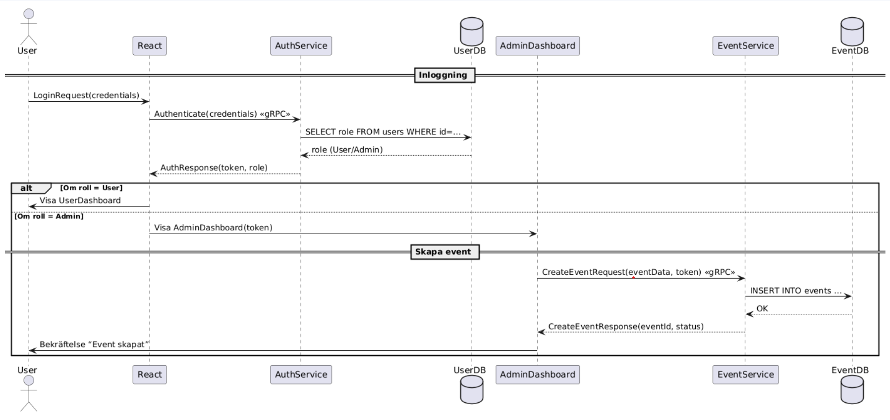

# Event Booking Microservice

Detta projekt är en del av ett grupparbete där vi utvecklat en **Event Booking-applikation** baserad på microservice-arkitektur. Systemet är byggt i .NET med flera separata lager för struktur och skalbarhet.

## 🧱 Projektstruktur

Projektet består av fem lager:

- **Presentation** – ASP.NET Core Web API, hanterar HTTP-anrop, Swagger och autentisering.
- **Business** – Innehåller services och affärslogik.
- **Data** – Entity Framework och repositories.
- **Domain** – Innehåller modeller, DTOs och responses.
- **xUnit** – Enhetstester för repository-lagret.

## 💻 Tekniker

- ASP.NET Core
- Entity Framework Core
- gRPC för intern kommunikation mellan tjänster
- REST för externa API-anrop
- Swagger (Swashbuckle) för API-dokumentation
- Azure SQL Server (databas)
- Azure App Service (deployment)
- Automapper (via egna MappingExtensions)
- xUnit för testning

## 🔄 Funktionalitet

CRUD-operationer (Create, Read, Update, Delete) stöds för **Event-entiteten** via gRPC och REST.

### Autentisering

Systemet stödjer två roller: `User` och `Admin`. Beroende på roll dirigeras användaren till rätt dashboard efter inloggning.

### Sekvensdiagram

Nedan visas ett sekvensdiagram som beskriver inloggning och skapande av ett event:

## 🚀 Deployment

Projektet är hostat via:

- **Azure SQL Server** för lagring av användare och event
- **Azure App Service** för deployment av API:t

## 🧪 Testning

Vi använder **xUnit** för att testa repositories i `Data`-lagret. Fokus ligger på att säkerställa att CRUD-funktionaliteten fungerar korrekt mot databasen.

---

## 📌 Att göra (valfritt)

- Hantering av biljetter och bokningar
- Rollbaserad behörighetskontroll i API
- Enhetstestning för business-lagret

## 🧑‍💻 Team

Detta projekt är utvecklat som en del av ett grupparbete på utbildningen Webbutvecklare .NET CMS vid Nackademin.

